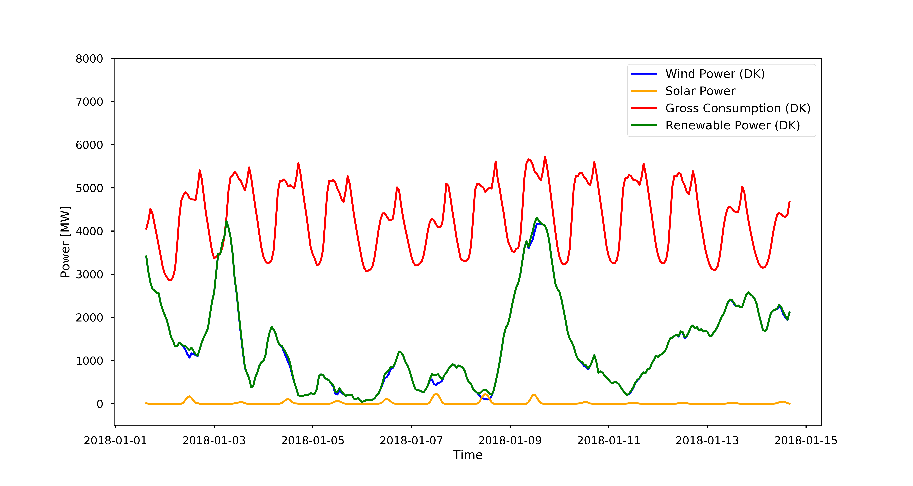
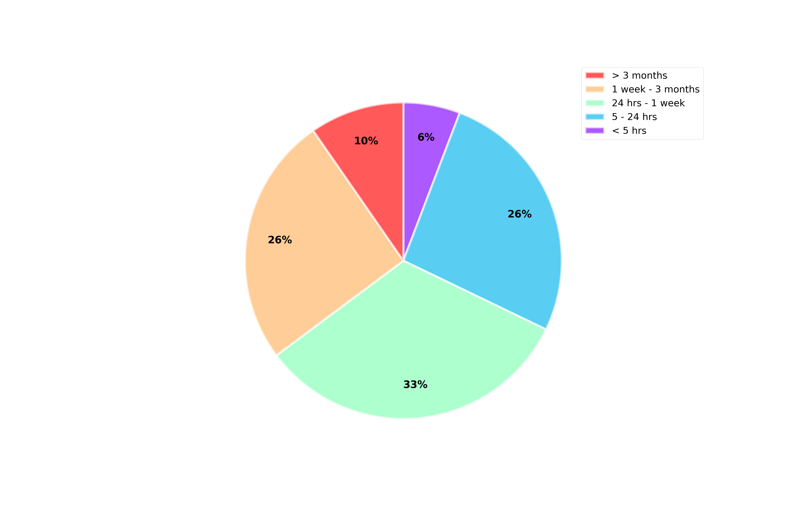
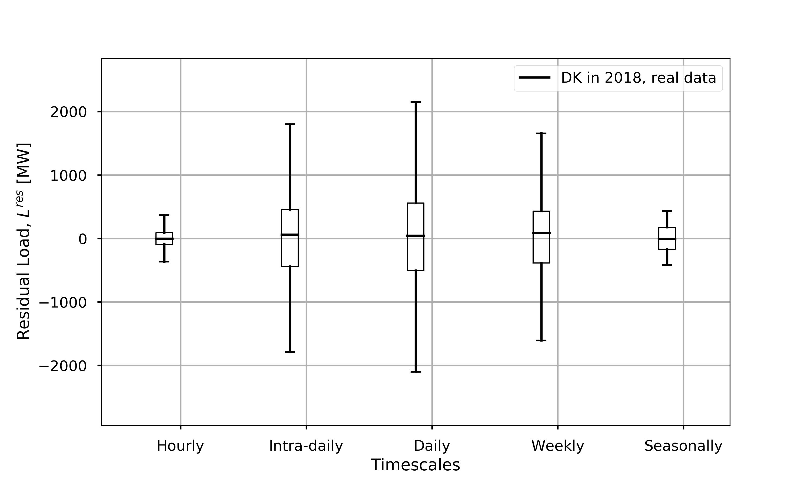

.. role:: python(code)
    :language: python

Tutorials
=========
:python:`FANFARE` is best run in a jupyter notebook and below are examples of what can be done with the provided notebooks.

To open and run a tutorial, go to the main directory of :python:`FANFARE` (where the *.ipynb files are) and type
``` ipython notebook``` or
``` jupyter notebook```

0. Creating a new dataset
-------------------------

See the notebook :python:`Tutorial 0 - Creating a new dataset.ipynb`

By going through the steps in this notebook, you should be able to generate the following plot with data from energidataservice.dk (Energinet data):



1. Hourly share of VRE in dataset
---------------------------------

See the notebook :python:`Tutorial 1 - Hourly share of VRE in dataset.ipynb`

In this notebook, the hourly share of VRE is calculated for a specified region. 
After calculating the VRE share, a histogram can be created to compare different regions:

.. figure:: figures/VRE_hourly_share.png
   :width: 700px
   :align: center


2. i) Oscillation analysis of residual load
-------------------------------------------

See the notebook :python:`Tutorial 2 -  i) Oscillation analysis of residual load.ipynb`

This is option (i) of the :python:`FANFARE` method (see frontpage), where the discrete Fourier transform (DFT) is calculated and split into different freqency intervals, 
and the resulting iDFTs of each interval is integrated. 
In this notebook, you get to chose the frequency intervals of interest and make a pie chart displaying the energy stored in each interval:



3. ii) Power requirements from DFT analysis
-------------------------------------------

See the notebook :python:`Tutorial 3 -  ii) Power requirements from DFT analysis.ipynb`

This is option (ii) of the :python:`FANFARE` method (see frontpage), where the spread in residual load whithin each frequency interval is investigated.




4. iii) Storage capacity requirements from DFT analysis
-------------------------------------------------------

See the notebook :python:`Tutorial 4 -  iii) Storage capacity requirements from DFT analysis.ipynb`

This is option (iii) of the :python:`FANFARE` method (see frontpage), where a cumulative sum of the residual load whithin each frequency interval is used to place requirements on the storage capacity for those timescales.

.. code-block:: python

   Capacity requirements:
   For frequency cut 0: 1.89e+00 GWh
   For frequency cut 1: 2.11e+01 GWh
   For frequency cut 2: 1.18e+02 GWh
   For frequency cut 3: 4.20e+02 GWh
   For frequency cut 4: 8.27e+02 GWh

